Publications
================

2018
-------

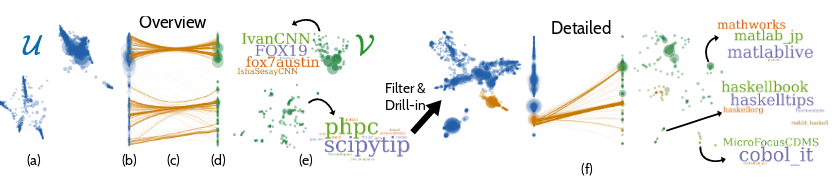

N. Pezzotti, JD Fekete, T. Höllt, J. van Gemert, B.P.F. Lelieveldt, E. Eisemann, A. Vilanova.
**Multiscale Visualization and Exploration of Large Bipartite Graphs**, Computer Graphics Forum (Proc. of EuroVis), 2018.
[PDF](https://hal.inria.fr/hal-01787046/document), [Video](https://youtu.be/wdJyvitvFkk).

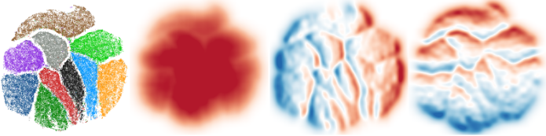

N. Pezzotti, A. Mordvintsev, T. Höllt, J. van Gemert, B.P.F. Lelieveldt, E. Eisemann, A. Vilanova.
**Linear tSNE optimization for the Web**, ArXiV preprint, 2018.
[PDF](https://arxiv.org/abs/1805.10817), [Demo](https://nicola17.github.io/tfjs-tsne-demo/), [Google AI post](https://ai.googleblog.com/2018/06/realtime-tsne-visualizations-with.html)

N. Li, V. van Unen, T. Höllt, A. Thompson, J. van Bergen, N. Pezzotti, E. Eisemann, A. Vilanova, S. Chuva de Sousa Lopes, B. Lelieveldt, F. Koning
**Mass cytometry reveals innate lymphoid cell differentiation pathways in the human fetal intestine**, Journal of Experimental Medicine, 2018.

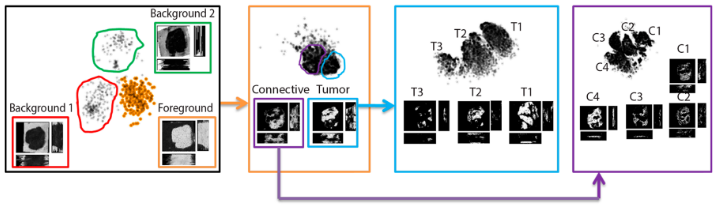

W.M. Abdelmoula, N. Pezzotti, T. Hölt, J. Dijkstra, A. Vilanova, L. A. McDonnell, B. P.F. Lelieveldt. **Interactive Visual Exploration of 3D Mass Spectrometry Imaging Data Using Hierarchical Stochastic Neighbor Embedding Reveals Spatiomolecular Structures at Full Data Resolution**. Journal of Proteome Research, 2018. [PDF](https://graphics.tudelft.nl/Publications-new/2018/APHDVML18/pdf.pdf)

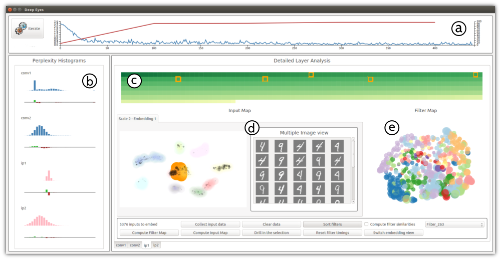
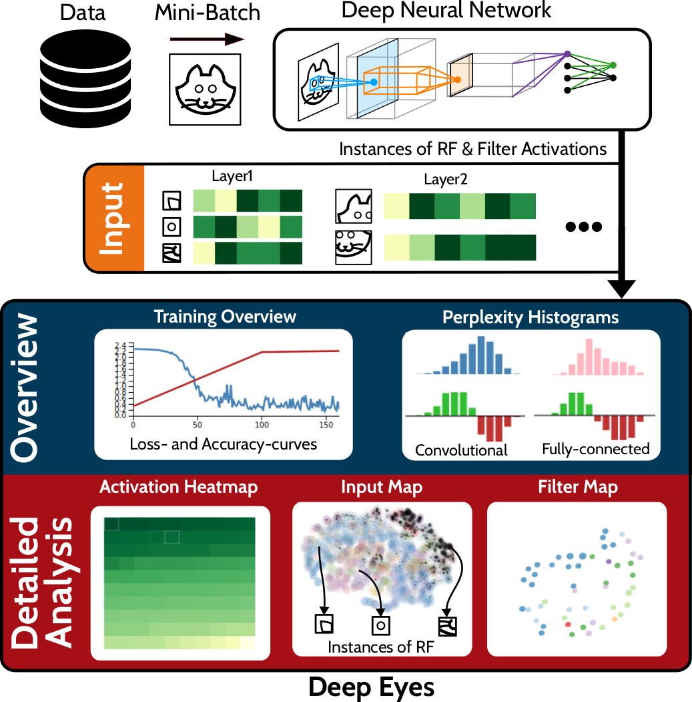

* N. Pezzotti, T. Höllt, J. van Gemert, B.P.F. Lelieveldt, E. Eisemann, A. Vilanova. **DeepEyes: Progressive Visual Analytics for Designing Deep Neural Networks**. Transaction on Visualization and Computer Graphics (Proceedings of IEEE VIS 2017), 2018. [PDF](https://graphics.tudelft.nl/Publications-new/2018/PHVLEV18/paper216.pdf), [Video](https://graphics.tudelft.nl/Publications-new/2018/PHVLEV18/file216.avi)

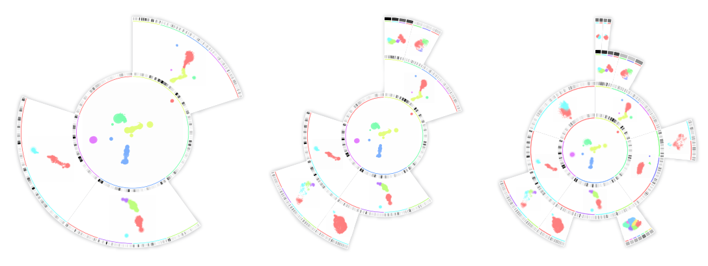

* T. Höllt, N. Pezzotti, V. van Unen, F. Koning, B.P.F. Lelieveldt, A. Vilanova. **CyteGuide: Visual Guidance for Hierarchical Single-Cell Analysis**. Transaction on Visualization and Computer Graphics (Proceedings of IEEE VIS 2017), 2018. [Website](https://cyteguide.cytosplore.org/)

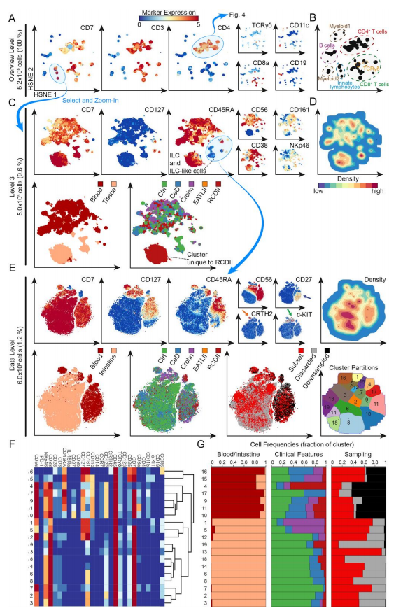

* V. van Unen\*, T. Hollt\*, N. Pezzotti\*, N. Li, M. J.T. Reinders, E. Eisemann, A. Vilanova, F. Koning, B. P.F. Lelieveldt. **Visual analysis of mass cytometry data by hierarchical stochastic neighbour embedding reveals rare cell types**. Nature Communications, 2018. [Website](https://www.nature.com/articles/s41467-017-01689-9) [PDF](https://www.nature.com/articles/s41467-017-01689-9.pdf)

2017
-------

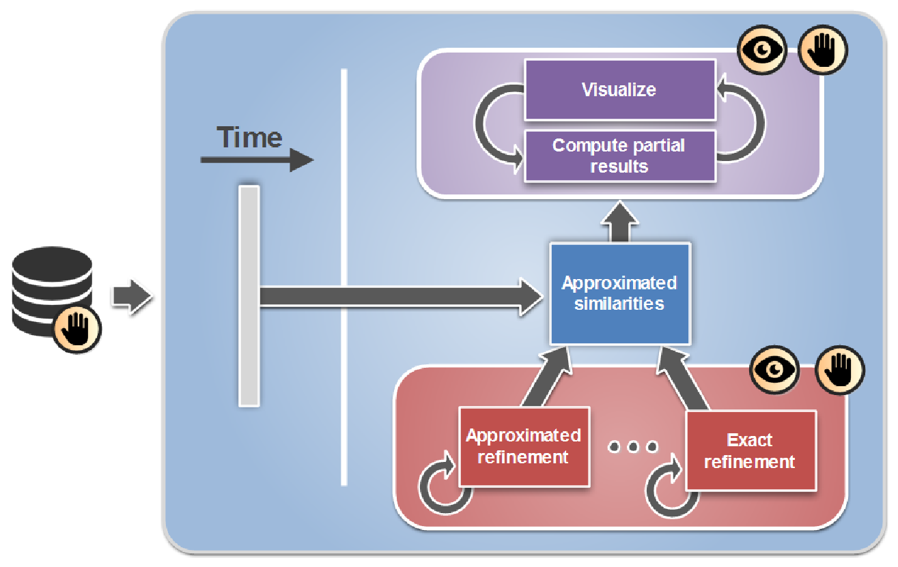
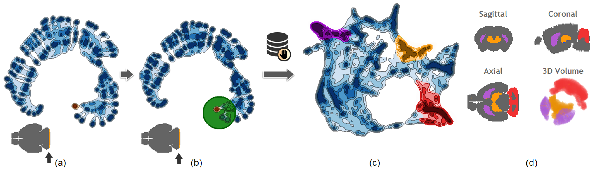

* N. Pezzotti, B.P.F. Lelieveldt, L. van der Maaten, T. Höllt, E. Eisemann, and A. Vilanova. **Approximated and User Steerable tSNE for Progressive Visual Analytics**. Transaction on Visualization and Computer Graphics (Presented at IEEE VIS 2016), 2017. [PDF](2016_AtSNE.pdf), [Suppl. Mat.](https://www.researchgate.net/publication/303305902_A-tSNE_supplemental_materials), [Video I](https://www.researchgate.net/publication/303305958_A-tSNE_Comparison_on_the_MNIST_dataset), [Video II](https://www.researchgate.net/publication/303305906_A-tSNE_Case_Study_I_-_Mouse_Brain), [Video III](https://www.researchgate.net/publication/303305908_A-tSNE_Case_Study_II_-_Data_Stream)

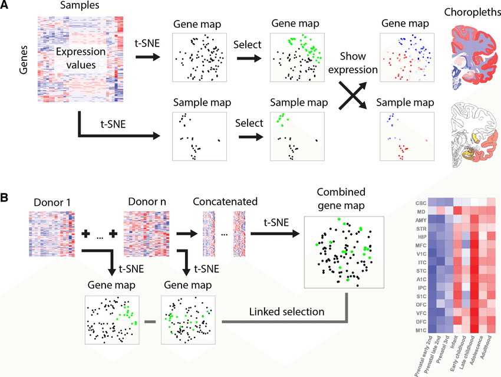
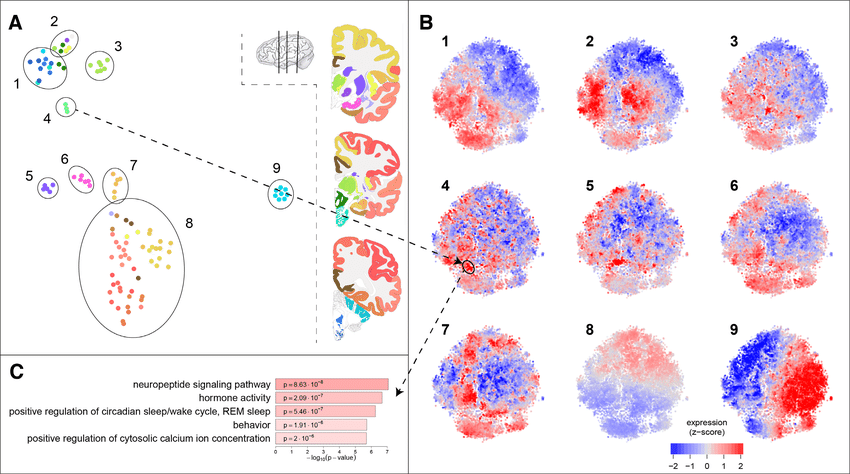
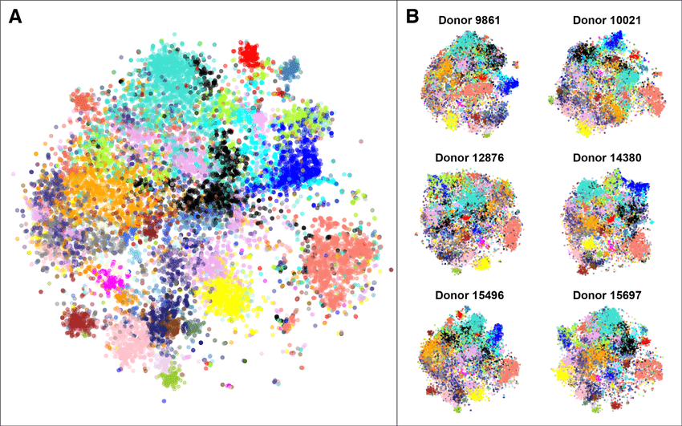

*  S.M.H. Huisman, B. van Lew, A. Mahfouz, N. Pezzotti, T. Höllt, L. Michielsen, A. Vilanova, M.J.T. Reinders, B.P.F. Lelieveldt. **BrainScope: interactive visual exploration of the spatial and temporal human brain transcriptome**. Nucleic Acids Research, 2017. [PDF](https://academic.oup.com/nar/article/doi/10.1093/nar/gkx046/2962180/BrainScope-interactive-visual-exploration-of-the#57983578), [Suppl. Mat.](https://www.researchgate.net/publication/313029596_BrainScope_interactive_visual_exploration_of_the_spatial_and_temporal_human_brain_transcriptome)

2016
-------

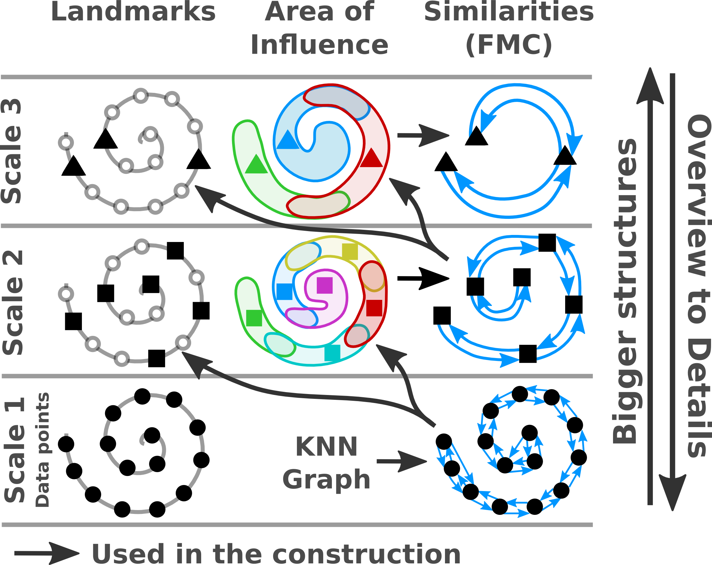
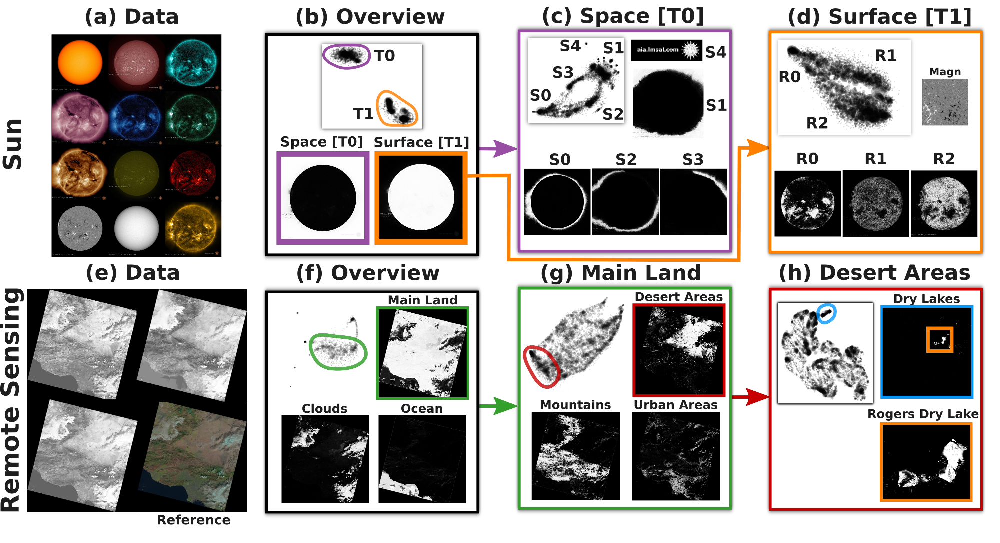
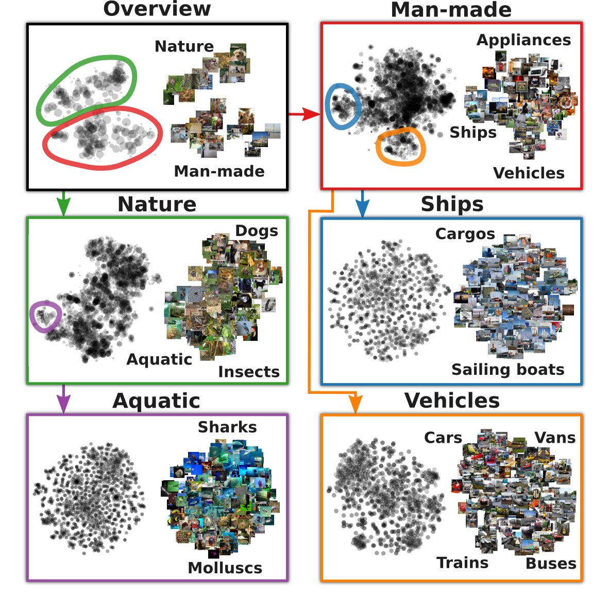

* N. Pezzotti, T. Höllt, B.P.F. Lelieveldt, E. Eisemann, A. Vilanova. **Hierarchical Stochastic Neighbor Embedding**. Computer Graphics Forum (Proc. of EuroVis), 2016. [PDF](/publications/2016_hsne/preprint.pdf), [Suppl. Mat.](/publications/2016_hsne/experiments.pdf), [Video](/publications/2016_hsne/sun_analysis.mp4), [Slides](http://www.slideshare.net/NicolaPezzotti/hierarchical-stochastic-neighbor-embedding)

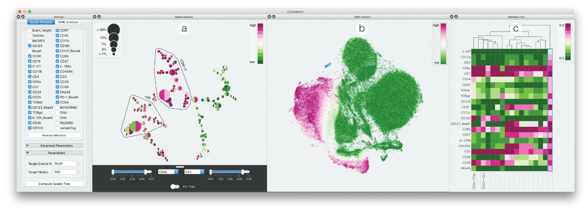

* T. Höllt, N. Pezzotti, V. van Unen, F. Koning, E. Eisemann, B.P.F. Lelieveldt, A. Vilanova. **Cytosplore: Interactive Immune Cell Phenotyping for Large Single-Cell Datasets**. Computer Graphics Forum (Proc. of EuroVis), 2016. [PDF](https://graphics.tudelft.nl/Publications-new/2016/HPVKELV16/eurovis16_Cytosplore_Interactive_Immune_Cell_Phenotyping_for_Large_Single-Cell_Datasets.pdf)

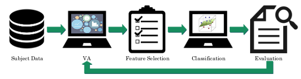

* R. Georgia Raidou, H. J. Kuijf, N. Sepasian, N. Pezzotti, W. H Bouvy, M. Breeuwer, A. Vilanova. **Employing Visual Analytics to Aid the Design of White Matter Hyperintensity Classifiers**. Medical Image Computing and Computer Assisted Intervention (MICCAI 2016), 2016. [PDF](https://graphics.tudelft.nl/Publications-new/2016/RKSPBBV16/paper1023.pdf)

2015
-------

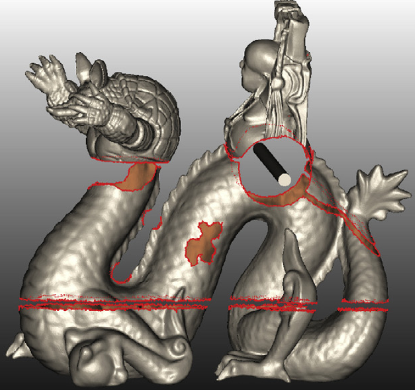
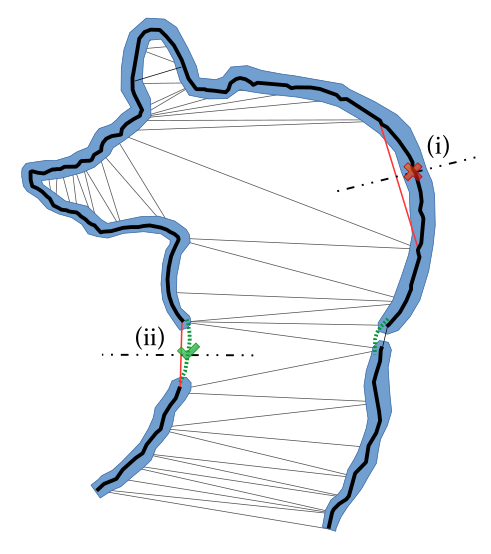
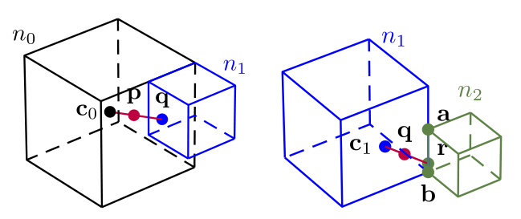

* M. Centin, N. Pezzotti, A. Signoroni. **Poisson-driven seamless completion of triangular meshes**. Computer Aided Geometric Design 35 (2015). [PDF](2014_Poisson_Driven_Seamless_completion.pdf), [Slides](2014_Poisson_Driven_Seamless_completion_presentation.pdf), [Bibtex](https://scholar.google.nl/scholar.bib?q=info:kmdSnlU02MkJ:scholar.google.com/&output=citation&scisig=AAGBfm0AAAAAVsRRbkgD9w_9f0NRdQmQFC2dA0Z5RWSy&scisf=4&hl=it&scfhb=1)

2013
-------

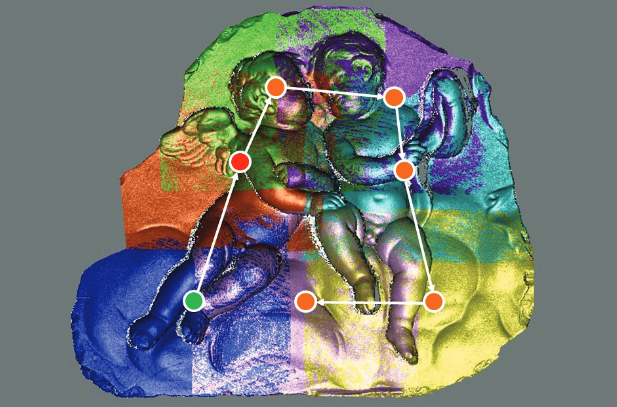
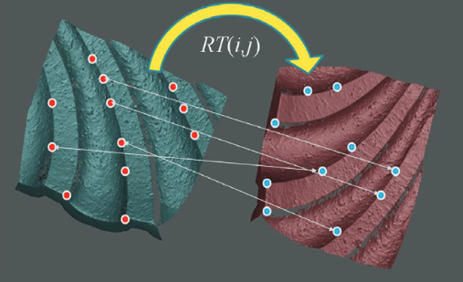
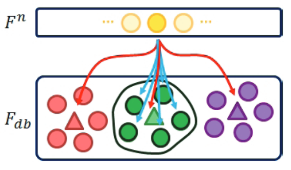

* F. Bonarrigo, N. Pezzotti, A. Signoroni. **On-the-fly automatic alignment and global registration of free-path collected 3D scans**. 2013 Digital Heritage International Congress. [PDF](2013_On-the-fly_automatic_alignment_and_global_registration_of_freepath_collected_3D_scans.pdf)

2012
-------

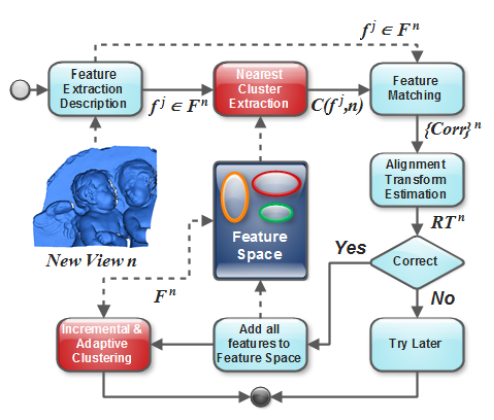
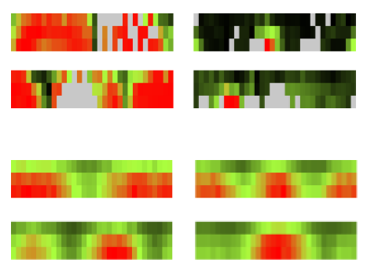
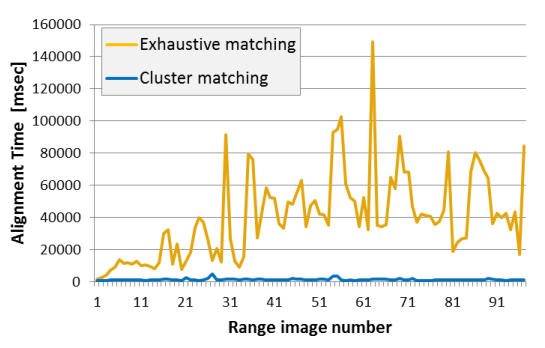

* N. Pezzotti, F. Bonarrigo, A. Signoroni. **Boosting the Computational Performance of Feature-Based Multiple 3D Scan Alignment by iat-k-means Clustering**. 3D Imaging, Modeling, Processing, Visualization and Transmission (3DIMPVT, now 3DV). [PDF](Boosting_the_computational_performance_of_feature_based_multiple_3D_scan_alignment_by_iat_k_means_clustering.pdf)
