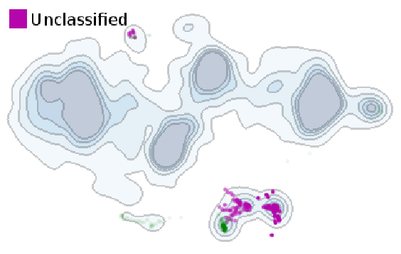

Publications
================

2016
-------

* N. Pezzotti, T. Höllt, B.P.F. Lelieveldt, E. Eisemann, A. Vilanova. **Hierarchical Stochastic Neighbor Embedding**. Computer Graphics Forum (Proc. of EuroVis), 2016. [PDF](publications/2016_hsne/preprint.pdf), [Suppl. Mat.](publications/2016_hsne/experiments.pdf), [Video](publications/2016_hsne/sun_analysis.mp4)

* T. Höllt, N. Pezzotti, V. van Unen, F. Koning, E. Eisemann, B.P.F. Lelieveldt, A. Vilanova. **Cytosplore: Interactive Immune Cell Phenotyping for Large Single-Cell Datasets**. Computer Graphics Forum (Proc. of EuroVis), 2016. [PDF](https://graphics.tudelft.nl/Publications-new/2016/HPVKELV16/eurovis16_Cytosplore_Interactive_Immune_Cell_Phenotyping_for_Large_Single-Cell_Datasets.pdf)

2015
-------

<!---->

* N. Pezzotti, B.P.F. Lelieveldt, L. van der Maaten, T. Höllt, E. Eisemann, and A. Vilanova. **Approximated and User Steerable tSNE for Progressive Visual Analytics**. *ArXiv*, 2015. [PDF](http://arxiv.org/pdf/1512.01655v2.pdf)

* M. Centin, N. Pezzotti, A. Signoroni. **Poisson-driven seamless completion of triangular meshes**. *Computer Aided Geometric Design 35 (2015) 42-55*. [PDF](2014_Poisson_Driven_Seamless_completion.pdf), [Slides](2014_Poisson_Driven_Seamless_completion_presentation.pdf), [Bibtex](https://scholar.google.nl/scholar.bib?q=info:kmdSnlU02MkJ:scholar.google.com/&output=citation&scisig=AAGBfm0AAAAAVsRRbkgD9w_9f0NRdQmQFC2dA0Z5RWSy&scisf=4&hl=it&scfhb=1)

2013
-------

* F. Bonarrigo, N. Pezzotti, A. Signoroni. **On-the-fly automatic alignment and global registration of free-path collected 3D scans**. *2013 Digital Heritage International Congress*. [PDF](2013_On-the-fly_automatic_alignment_and_global_registration_of_freepath_collected_3D_scans.pdf)

2012
-------

* N. Pezzotti, F. Bonarrigo, A. Signoroni. **Boosting the Computational Performance of Feature-Based Multiple 3D Scan Alignment by iat-k-means Clustering**. *3D Imaging, Modeling, Processing, Visualization and Transmission (3DIMPVT)*. [PDF](Boosting_the_computational_performance_of_feature_based_multiple_3D_scan_alignment_by_iat_k_means_clustering.pdf)

